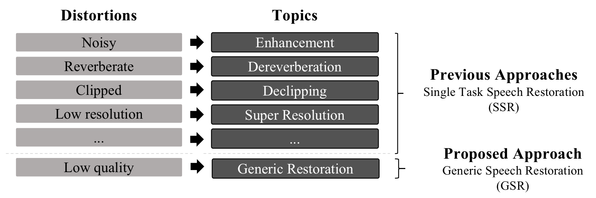

# 

# VoiceFixer
VoiceFixer is a framework for general speech restoration. We aim at the restoration of severly degraded and historical speech.

# Paper
Will be available before Oct.03 2021!

# Train from scratch
Still working on it, stay tuned! Expect to be available before 2021.09.30.

# Demo
You can listen to some [demo](https://haoheliu.github.io/demopage-voicefixer/) here.

You can also try voicefixer using your own voice on [colab](https://colab.research.google.com/drive/1HYYUepIsl2aXsdET6P_AmNVXuWP1MCMf?usp=sharing)!

# Citation
Will be available once the paper is ready.

