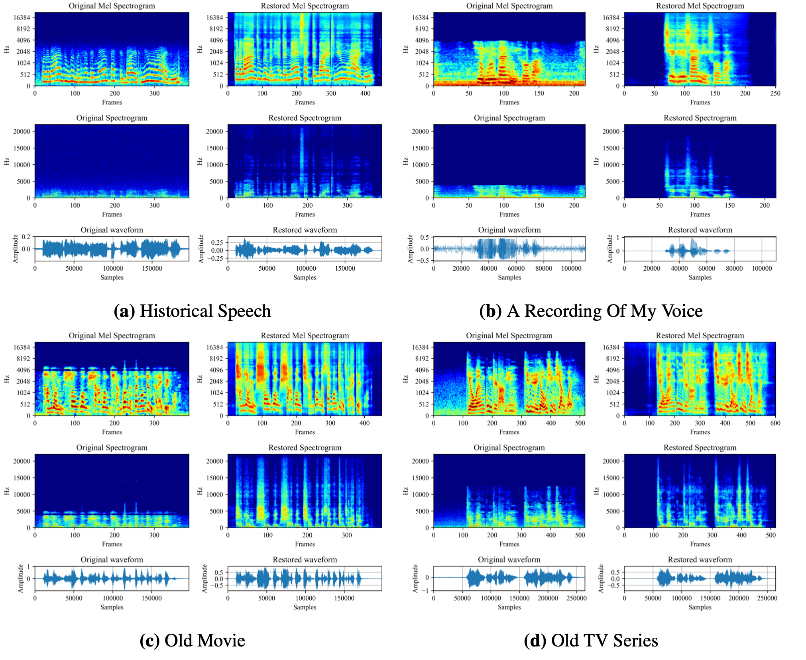
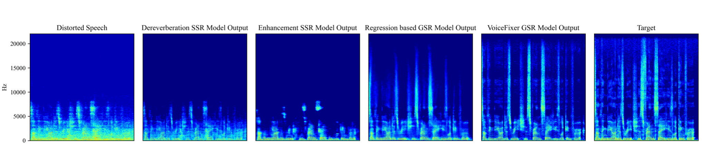
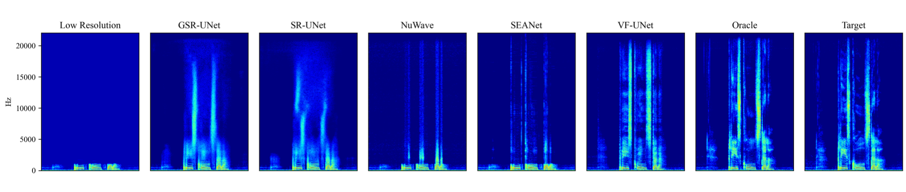

[](https://arxiv.org/abs/2109.13731) [](https://colab.research.google.com/drive/1HYYUepIsl2aXsdET6P_AmNVXuWP1MCMf?usp=sharing) [](https://badge.fury.io/py/voicefixer) [](https://haoheliu.github.io/demopage-voicefixer)

# VoiceFixer

VoiceFixer is a framework for general speech restoration. We aim at the restoration of severely degraded speech and historical speech.

[](https://imgtu.com/i/46dPxJ)

- [VoiceFixer](#voicefixer)
  * [Materials](#materials)
  * [Usage](#usage)
    + [Environment](#environment)
    + [General Speech Restoration (GSR)](#general-speech-restoration--gsr-)
      - [Train from scratch](#train-from-scratch)
      - [Evaluation](#evaluation)
    + [Single Task Speech Restoration (SSR)](#single-task-speech-restoration--ssr-)
      - [Train from scratch](#train-from-scratch-1)
      - [Evaluation](#evaluation-1)
  * [Project Structure](#project-structure)
  * [Citation](#citation)
  
## Materials

- *Arxiv* preprint: https://arxiv.org/abs/2109.13731 
- [Demo page](https://haoheliu.github.io/demopage-voicefixer/) contains comparison between single task speech restoration, general speech restoration, and voicefixer.
- We wrote a [pip package](https://pypi.org/project/voicefixer) for voicefixer.
- You can try voicefixer using your own voice on [colab](https://colab.research.google.com/drive/1HYYUepIsl2aXsdET6P_AmNVXuWP1MCMf?usp=sharing)!
- Integrated to [Huggingface Spaces](https://huggingface.co/spaces) with [Gradio](https://github.com/gradio-app/gradio). See [Gradio Web Demo](https://huggingface.co/spaces/akhaliq/VoiceFixer)

## Usage

### Environment
```shell script
# Download dataset and prepare running environment
source init.sh 
```

### General Speech Restoration (GSR)

**Here we take *VF_UNet*(voicefixer with unet as analysis module) as an example.**
Other GSR model have the similar folder structure, training entry and evaluation logic.

#### Train from scratch 

Change directory and run training entry.

```shell script
cd general_speech_restoration/voicefixer/unet
# Use default settings
source run.sh
```

Also you can personalize your training:
- By modifying *aug_conf* in *voicefixer/config.py* you can setup the augmentation parameters.
- By changing *--aug_effects* flag in run.sh. You can have more augmentation effects.
    - For example: You can pass in *--aug_effects low_pass clip reverb_rir reverb_freeverb high_pass treble bass fade*
- ...

After that, you will automatically get a log directory that look like this

```python3
├── unet
    ├── pc_log
        └── 2021-09-30-unet-#vocalsnoise#-#vctkvd_noise#-#gsr#-voicefixer_unet-l1#1500_44100#
            └── version_0
                ├── args.pkl
                └── checkpoints 
                    └── epoch=1.ckpt
                ├── code # Pin the version of code you use
                │   ├── config.py
                │   ├── dm_sr_rand_sr_order.py
                │   ├── get_model.py
                │   ├── handler.py
                │   ├── model.py
                │   ├── model_kqq.py
                │   ├── modules.py
                │   ├── run.sh
                │   └── train.py
                ├── events.out.tfevents.1632965925.liuhaohes-MacBook-Pro.local.3521.0 # tensorboard
                ├── git_version # git commit id when you run the code
                └── hparams.yaml
``` 

#### Evaluation

Automatic evaluation and generate .csv file for the GSR evaluation results.

First you should stay in the following directory:
```shell script
cd general_speech_restoration/voicefixer/unet
```
For example, if you like to evaluate on all testset. 
```shell script
python3 handler.py  -c  log/2021-09-30-xxx/version_0/checkpoints/epoch=1.ckpt \
                    -t  base \ 
                    -d  all_test_set 
```

For example, if you just wanna evaluate on GSR testset. 
```shell script
python3 handler.py  -c  log/2021-09-30-xxx/version_0/checkpoints/epoch=1.ckpt \
                    -t  general_speech_restoration \ 
                    -d  general_speech_restoration_eval 
```

There are generally seven testsets you can pass to **-t**: 
- **base**: all testset
- **clip**: testset with speech that have clipping threshold of 0.1, 0.25, and 0.5
- **reverb**: testset with reverberate speech
- **general_speech_restoration**: testset with speech that contain all kinds of random distortions
- **enhancement**: testset with noisy speech
- **speech_super_resolution**: testset with low resolution speech that have sampling rate of 2kHz, 4kHz, 8kHz, 16kHz, and 24kHz.

And if you would like to evaluate on a small portion of data, e.g. 10 utterance.

```shell script
python3 handler.py  -c  log/2021-09-30-xxx/version_0/checkpoints/epoch=1.ckpt \
                    -t  base \ 
                    -d  only_ten_utterance_for_each_testset \ 
                    -l 10 
```

Evaluation results will be presented in the *exp_results* folder.

To sum, *handler.py* accept the following input format.
```
# Basic usage
python3 handler.py  -c <str, path-to-checkpoint> \
                    -t <str, testset> \ 
                    -l <int, limit-utterance-number> \ 
                    -d <str, description of this evaluation> \ 
```


### Single Task Speech Restoration (SSR)

**Here we take enhancement *UNet*(Enh-UNet) as an example.**
Other SSR model have the similar folder structure, training entry and evaluation logic.

#### Train from scratch

Change directory and run training entry

```shell script
cd single_task_speech_restoration/enhancement/unet
# Using default setting
source run.sh 
```

After that, you will automatically get a log directory that look like this

```python3
├── unet
    ├── pc_log
        └── 2021-09-30-unet-#vocalsnoise#-#vctkvd_noise#-##-fixed_4k_44k_mask_gan-l1#44100_44100#
            └── version_0
                ├── args.pkl
                ├── checkpoints
                ├── code
                │   ├── config.py
                │   ├── dm_sr_rand_sr_order.py
                │   ├── get_model.py
                │   ├── handler.py
                │   ├── model.py
                │   ├── model_kqq.py
                │   ├── modules.py
                │   ├── run.sh
                │   └── train.py
                ├── events.out.tfevents.1632965734.liuhaohes-MacBook-Pro.local.3017.0
                ├── git_version
                └── hparams.yaml
```

#### Evaluation

Automatic evaluation and generate .csv file for the GSR evaluation results.

```shell script
cd single_task_speech_restoration/declip/unet
```

For example, if you like to evaluate on clipping testset. 
```shell script
python3 handler.py  -c  log/2021-09-30-xxx/version_0/checkpoints/epoch=1.ckpt \
                    -t  clip \ 
                    -d  declipping_model_evaluation 
```

If you like to evaluate on GSR testset. 
```shell script
python3 handler.py  -c  log/2021-09-30-xxx/version_0/checkpoints/epoch=1.ckpt \
                    -t  general_speech_restoration \ 
                    -d  declipping_model_evaluation_with_GSR_testset 
```

There are generally seven testsets you can pass to **-t**: 
- **base**: all testset
- **clip**: testset with speech that have clipping threshold of 0.1, 0.25, and 0.5
- **reverb**: testset with reverberate speech
- **general_speech_restoration**: testset with speech that contain all kinds of random distortions
- **enhancement**: testset with noisy speech
- **speech_super_resolution**: testset with low resolution speech that have sampling rate of 2kHz, 4kHz, 8kHz, 16kHz, and 24kHz.

And if you would like to evaluate on a small portion of data, e.g. 10 utterance.

```shell script
python3 handler.py  -c  log/2021-09-30-xxx/version_0/checkpoints/epoch=1.ckpt \
                    -t  base \ 
                    -d  all_test_set \ 
                    -l 10 
```

Evaluation results will be presented in the *exp_results* folder.

To sum, *handler.py* accept the following input format.
```
# Basic usage
python3 handler.py  -c <str, path-to-checkpoint> \
                    -t <str, testset> \ 
                    -l <int, limit-utterance-number> \ 
                    -d <str, description of this evaluation> \ 
```

## Project Structure

``` python
.
├── dataloaders 
│   ├── augmentation # code for speech data augmentation.
│   └── dataloader # code for different kinds of dataloaders.
├── datasets 
│   ├── datasetParser # code for preparing each dataset
│   └── se # Dataset for speech enhancement (source init.sh)
│       ├── RIR_44k # Room Impulse Response 44.1kHz
│       │   ├── test
│       │   └── train
│       ├── TestSets # Evaluation datasets
│       │   ├── ALL_GSR # General speech restoration testset
│       │   │   ├── simulated
│       │   │   └── target
│       │   ├── DECLI # Speech declipping testset
│       │   │   ├── 0.1 # Different clipping threshold
│       │   │   ├── 0.25
│       │   │   ├── 0.5
│       │   │   └── GroundTruth
│       │   ├── DENOISE # Speech enhancement testset
│       │   │   └── vd_test
│       │   │       ├── clean_testset_wav
│       │   │       └── noisy_testset_wav
│       │   ├── DEREV # Speech dereverberation testset
│       │   │   ├── GroundTruth
│       │   │   └── Reverb_Speech
│       │   └── SR # Speech super resolution testset
│       │       ├── GroundTruth
│       │       └── cheby1
│       │           ├── 1000 # Different cutoff frequencies
│       │           ├── 12000
│       │           ├── 2000
│       │           ├── 4000
│       │           └── 8000
│       ├── vd_noise # Noise training dataset
│       └── wav48 # Speech training dataset
│           ├── test # Not used, included for completeness
│           └── train 
├── evaluation # The code for model evaluation
├── exp_results # The Folder that store evaluation result (in handler.py).
├── general_speech_restoration # GSR 
│   ├── unet # GSR_UNet
│   │   └── model_kqq_lstm_mask_gan
│   └── voicefixer # Each folder contains the training entry for each model.
│       ├── dnn # VF_DNN
│       ├── lstm # VF_LSTM
│       ├── unet # VF_UNet
│       └── unet_small # VF_UNet_S
├── resources 
├── single_task_speech_restoration # SSR
│   ├── declip_unet # Declip_UNet
│   ├── derev_unet # Derev_UNet
│   ├── enh_unet # Enh_UNet
│   └── sr_unet # SR_UNet
├── tools
└── callbacks
```

## Citation

```bib
 @misc{liu2021voicefixer,   
     title={VoiceFixer: Toward General Speech Restoration With Neural Vocoder},   
     author={Haohe Liu and Qiuqiang Kong and Qiao Tian and Yan Zhao and DeLiang Wang and Chuanzeng Huang and Yuxuan Wang},  
     year={2021},  
     eprint={2109.13731},  
     archivePrefix={arXiv},  
     primaryClass={cs.SD}  
 }
```






